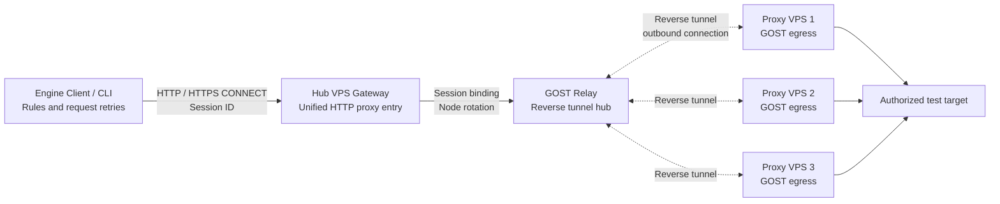

# Python GOST Proxy Pool

<a href="README.md">English</a> | <a href="README.zh-CN.md">中文</a>

This project builds a unified proxy pool on self-owned servers and provides multiple public egress IPs for HTTP/HTTPS requests. The client selects and rotates proxy addresses through three modes, so application code does not need to manage each server separately.

The server groups multiple proxy VPS nodes into one pool, while the client decides when to rotate. Deployment uploads and starts the tunnel automatically; normal use is through the client API or CLI.

## Architecture




## Server configuration

Edit `server/server_config.yaml` before installation:

```yaml
reverse_tunnel:
  enabled: true
  hub_host: "PUBLIC_HUB_VPS_IP"
  relay_host: "0.0.0.0"
  relay_port: 443
  entry_host: "127.0.0.1"
  entry_port_base: "11000-12000"

gateway:
  enabled: true
  listen_host: "0.0.0.0"
  listen_port: 8080
  username: proxy
  password: "${GATEWAY_PASSWORD}"
  session_ttl_seconds: 300
```

Fill in SSH details, node IDs, and the GOST binary directory for each remote node, using `reverse_gost_client` as the node kind. Ports are assigned in node order; each node tries up to five occupied ports. The mapping is saved to `state/entry_ports.json` and reused by Gateway restarts. Open TCP 443 and TCP 8080 in the hub security group; ports 11000-12000 bind only on the hub.

## Server installation

Run these commands on the hub VPS:

```cmd
cd /path/to/proxy/server
python3 -m pip install -r requirements.txt
export SSH_PASSWORD='server SSH password'
export GOST_PROXY_PASSWORD='Relay password'
python3 install.py server_config.yaml
```

In reverse mode the installer starts the Relay on the hub, detects amd64 or arm64 on every remote VPS, uploads GOST, creates reverse client systemd services, and checks that the tunnels and services started successfully.

After installation, entry port assignments are saved in `state/entry_ports.json`. Gateway startup and restart reuse this mapping instead of reallocating ports for established tunnels.

## Server status, logs, and uninstall

Service status:

```bash
sudo systemctl status proxy-pool-gateway.service
sudo systemctl status proxy-pool-gost-relay.service
```

Gateway logs are stored at `server/log/gateway.log`. Follow the log:

```bash
tail -f /path/to/proxy/server/log/gateway.log
```

View systemd logs and listening ports:

```bash
sudo journalctl -u proxy-pool-gateway.service -n 100 --no-pager
sudo journalctl -u proxy-pool-gost-relay.service -n 100 --no-pager
sudo ss -lntp | grep -E '110[0-9][0-9]|8080|443'
```

Server uninstall:

```bash
python3 uninstall.py stop server_config.yaml
python3 uninstall.py clean server_config.yaml
python3 uninstall.py purge server_config.yaml
```

`stop` stops services, `clean` also removes remote GOST binaries, and `purge` also removes the local hub installation directory.

## Client installation and usage

Install the client on the machine that sends HTTP/HTTPS requests. It connects to the Gateway on the hub VPS, does not change the system proxy, and does not install GOST on the client machine.

Before installation, edit `client/client_config.yaml` with the hub address and client mode:

```yaml
gateway:
  url: "http://PUBLIC_HUB_VPS_IP:8080"
  username: proxy
  password: "${GATEWAY_PASSWORD}"
  verify_tls: true
  timeout_seconds: 30

selector:
  mode: rules
  rotate_after: 5
  max_attempts_on_403: 3
  block_statuses: [403, 418, 429]
```

Install dependencies and validate the connection from the `client` directory:

```bash
cd /path/to/proxy/client
python3 -m pip install -r requirements.txt
export GATEWAY_PASSWORD='Gateway password'
python3 install_client.py client_config.yaml
```

Installation saves the configuration to `~/.proxy-pool/client_config.yaml`, so later CLI calls do not need `--config`. Set the hub public address in `gateway.url`, for example `http://38.207.176.121:8080`. In Windows CMD use `set "GATEWAY_PASSWORD=Gateway password"`.

## Client modes

Rules mode rotates on configured block statuses and tries at most three nodes:

```bash
python3 client_cli.py request --mode rules http://authorized.example/deny
```

To test 403 rotation, start a test page on a host reachable from the proxy nodes:

```bash
python3 test_403_server.py --host 0.0.0.0 --port 18080 --status 403
```

Fixed-count mode ignores 403, 418, and 429 and rotates only after the configured number of logical requests. Multiple targets run in one session:

```bash
python3 client_cli.py request --mode fixed_count https://target-01.example https://target-02.example https://target-03.example
```

Random mode ignores response status and chooses a random proxy node for each target:

```bash
python3 client_cli.py request --mode random https://target-01.example https://target-02.example https://target-03.example
```

Check Gateway and session status:

```bash
python3 client_cli.py health
```

Python API usage:

```python
from proxy_client import ProxyClient

client = ProxyClient.from_config("client_config.yaml")
try:
    result = client.request("GET", "https://example.com")
    print(result.response.status_code, result.proxy_id, result.attempts)
finally:
    client.close()
```

Uninstall the client on Linux or Windows:

```bash
python3 uninstall_client.py
```

Add `--purge` to remove the saved default configuration and local cache:

```bash
python3 uninstall_client.py --purge
```

For request failures, inspect the Gateway log on the hub VPS:

```bash
tail -f /path/to/proxy/server/log/gateway.log
```
