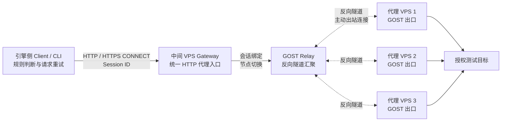

# Python GOST 代理池

<a href="README.md">English</a> | <a href="README.zh-CN.md">中文</a>

这个项目用于在自有服务器上搭建统一的代理池，为 HTTP/HTTPS 请求提供多个公网出口。当需要更换代理地址时，客户端可以根据三种模式选择和轮换代理，不需要在业务代码中单独管理每台服务器。

服务端负责把多台代理 VPS 组织成一个代理池，客户端负责根据请求结果选择是否切换。部署时自动上传并启动隧道，使用时只需要调用客户端接口或 CLI。

## 架构图




## 服务端配置

安装前先编辑 `server/server_config.yaml`：

```yaml
reverse_tunnel:
  enabled: true
  hub_host: "中间VPS公网IP"
  relay_host: "0.0.0.0"
  relay_port: 443
  entry_host: "127.0.0.1"
  entry_port_base: "11000-12000"

gateway:
  enabled: true
  listen_host: "0.0.0.0"
  listen_port: 8080
  username: proxy
  password: "${GATEWAY_PASSWORD}"
  session_ttl_seconds: 300
```

每台远端节点填写 SSH 信息、节点 ID 和 GOST 文件目录，节点类型使用 `reverse_gost_client`。端口按节点顺序分配；端口被占用时每个节点最多向后尝试 5 个端口。分配结果保存到 `state/entry_ports.json`，Gateway 重启时沿用该记录。云安全组放行中间 VPS 的 TCP 443 和 TCP 8080；11000-12000 只绑定中间 VPS 本机。

## 服务端安装

在中间 VPS 的终端中执行：

```cmd
cd /path/to/proxy/server
python3 -m pip install -r requirements.txt
export SSH_PASSWORD='服务器SSH密码'
export GOST_PROXY_PASSWORD='Relay密码'
python3 install.py server_config.yaml
```

在反向模式下，安装程序会先在中间 VPS 启动 Relay，再自动识别每台远端 VPS 的 amd64/arm64 架构、上传 GOST、创建反向客户端 systemd 服务，并检查隧道和服务是否启动成功。

安装完成后，入口端口映射会保存到 `state/entry_ports.json`。Gateway 启动或重启时读取该文件，不会重新分配已建立隧道的端口。
## 服务端状态、日志和卸载

查看服务状态：

```bash
sudo systemctl status proxy-pool-gateway.service
sudo systemctl status proxy-pool-gost-relay.service
```

Gateway 日志位置：`server/log/gateway.log`。持续查看日志：

```bash
tail -f /path/to/proxy/server/log/gateway.log
```

查看 systemd 日志和监听端口：

```bash
sudo journalctl -u proxy-pool-gateway.service -n 100 --no-pager
sudo journalctl -u proxy-pool-gost-relay.service -n 100 --no-pager
sudo ss -lntp | grep -E '110[0-9][0-9]|8080|443'
```

服务端卸载：

```bash
python3 uninstall.py stop server_config.yaml
python3 uninstall.py clean server_config.yaml
python3 uninstall.py purge server_config.yaml
```

`stop` 只停止服务，`clean` 还会删除远端 GOST，`purge` 还会删除中间 VPS 的本地安装目录。

## 客户端安装和使用

客户端安装在发起 HTTP/HTTPS 请求的机器上。它只连接中间 VPS 的 Gateway，不会修改系统代理，也不会在客户端机器上部署 GOST。

安装前先编辑 `client/client_config.yaml`，填写中间 VPS 地址和客户端模式：

```yaml
gateway:
  url: "http://中间VPS公网IP:8080"
  username: proxy
  password: "${GATEWAY_PASSWORD}"
  verify_tls: true
  timeout_seconds: 30

selector:
  mode: rules
  rotate_after: 5
  max_attempts_on_403: 3
  block_statuses: [403, 418, 429]
```

进入 `client` 目录安装依赖并验证连接：

```bash
cd /path/to/proxy/client
python3 -m pip install -r requirements.txt
export GATEWAY_PASSWORD='Gateway密码'
python3 install_client.py client_config.yaml
```

安装成功后会把配置保存到 `~/.proxy-pool/client_config.yaml`，后续可以不再指定 `--config`。Gateway 地址在 `client_config.yaml` 的 `gateway.url` 中填写中间 VPS 公网 IP 和端口，例如 `http://38.207.176.121:8080`。Windows CMD 中使用 `set "GATEWAY_PASSWORD=Gateway密码"`。

## 客户端三种模式

规则模式遇到配置的拦截状态码时切换节点，最多尝试三次：

```bash
python3 client_cli.py request --mode rules http://授权测试地址/deny
```

如需本地验证 403 轮换，可在可被代理节点访问的测试服务器上启动：

```bash
python3 test_403_server.py --host 0.0.0.0 --port 18080 --status 403
```

固定次数模式不根据 403、418、429 切换，只在完成指定数量的逻辑请求后切换。多个目标会在同一会话内依次访问：

```bash
python3 client_cli.py request --mode fixed_count https://target-01.example https://target-02.example https://target-03.example
```

随机模式不根据状态码切换，每个目标随机选择代理节点：

```bash
python3 client_cli.py request --mode random https://target-01.example https://target-02.example https://target-03.example
```

查看 Gateway 和会话状态：

```bash
python3 client_cli.py health
```

Python API 调用：

```python
from proxy_client import ProxyClient

client = ProxyClient.from_config("client_config.yaml")
try:
    result = client.request("GET", "https://example.com")
    print(result.response.status_code, result.proxy_id, result.attempts)
finally:
    client.close()
```

客户端卸载：

```bash
python3 uninstall_client.py
```

Windows、Linux 都支持。加上 `--purge` 会删除客户端保存的默认配置和缓存：

```bash
python3 uninstall_client.py --purge
```

客户端请求失败时，先查看中间 VPS 的 Gateway 日志：

```bash
tail -f /path/to/proxy/server/log/gateway.log
```
